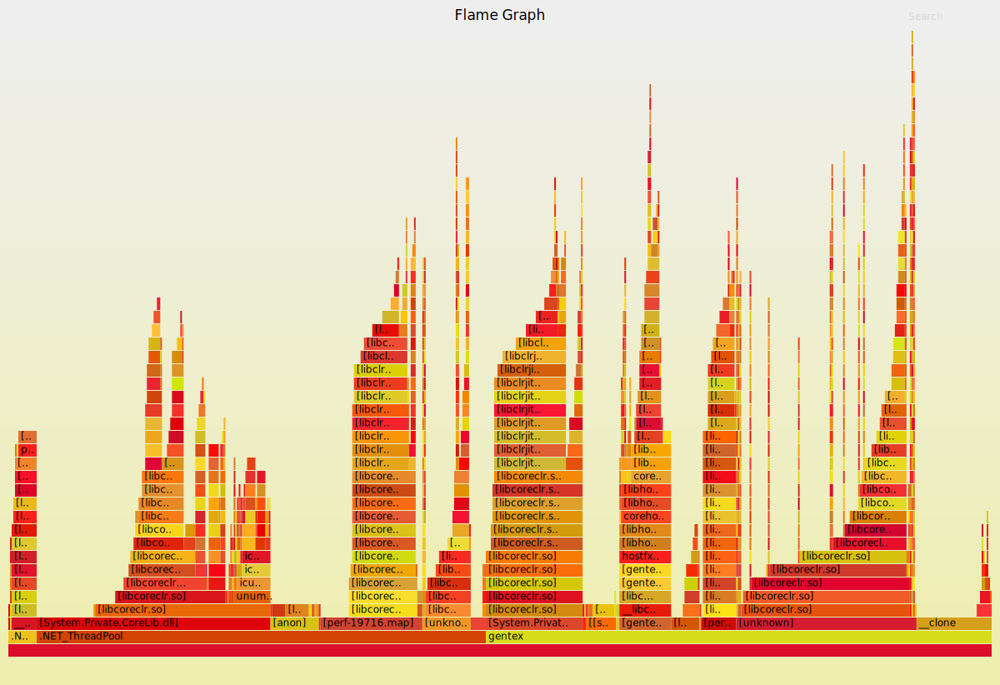
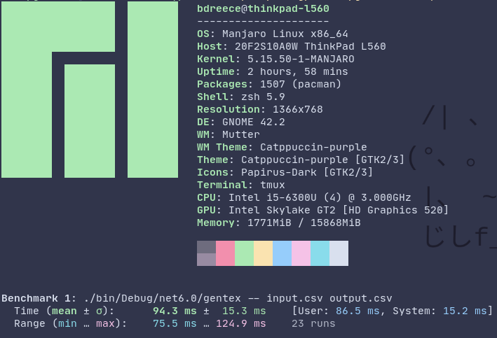

# Gentex Coding Exercise

This is a submission repository for the Machine Vision Development Engineer
coding exercise from Gentex.

## Running the program

My solution to the coding exercise is a .NET console application, which can be
built and run with the following commands:

```bash
git clone https://github.com/bdreece/gentex-coding-exercise
cd gentex-coding-exercise
dotnet run gentex input.csv output.csv
```

## Some profiling stats

### Perf Flamegraph



### Hyperfine Benchmark


